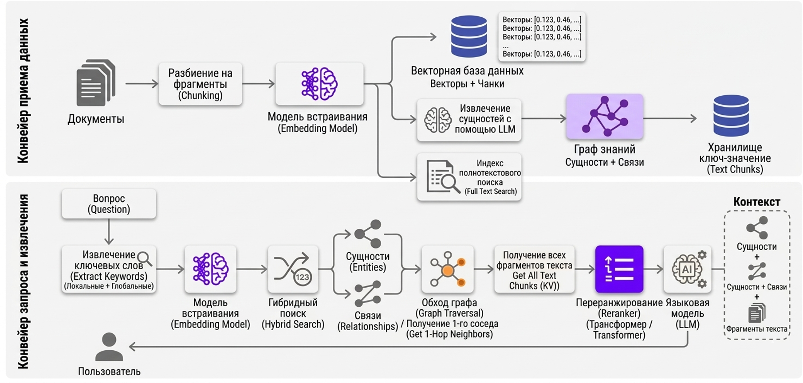

# Реализация модульной RAG сиcтемы

## Основные компоненты гибридного поиска
Cистема объединяет три различных метода извлечения данных

### Плотный поиск (Dense Retrieval / Semantic Search):

Основан на векторных эмбеддингах (например, OpenAI text-embedding-3), которые представляют текст в виде чисел в многомер[...]
Преимущества: Отлично понимает смысл, контекст, синонимы и многоязычные запросы (например, связывает слова "с[...]
Недостатки: Является "черным ящиком" и часто не справляется с поиском точных идентификаторов, артикулов или р[...]

### Разреженный поиск (Sparse Retrieval / Lexical Search):

Известен как полнотекстовый поиск (Full Text Search). Он разбивает текст на токены (слова или их части) и строит инвер[...]
Преимущества: Высокая точность при поиске конкретных ключевых слов. Использует алгоритмы ранжирования, таки[...]
Недостатки: Не понимает смысла слов и чувствителен к опечаткам. Кроме того, процессы токенизации могут "разры[...]
### Поиск по шаблону (Pattern Matching):

Используется как резервный механизм (fallback) для поиска подстрок, ID и кодов
Реализуется через операторы вроде Ilike в SQL или через n-граммы (фрагменты символов). Это позволяет найти точный [...]

## Подготовка данных (Ingestion)

Использование специализированных экстракторов: Для PDF-файлов, HTML, MS Excel, Markdown, CSV, Plain text и прочих используются с[...]
Обогащение метаданных: К каждому фрагменту (чанку) добавляются описания или ключевая информация через LLM пер[...]
Индексация в БД: В Postgres создается колонка TSVector, которая автоматически генерирует токены из контента для полн[...]

## Динамическое взвешивание (Dynamic Weighting) - использование рассуждений LLM для определения весов поиска

1. Агент анализирует вопрос пользователя.
2. Если вопрос содержит код (например, HLR 57212), агент назначает высокий вес (например, 70%) для Pattern Matching, так как эт[...]
3. Если вопрос общий ("Определение блокировки"), приоритет отдается семантическому и полнотекстовому поиску.
4. Агент передает эти веса (dense_weight, sparse_weight, pattern_weight) в функцию поиска

## Техническая реализация в Postgres

Процесс поиска реализуется через Database Function, которая выполняет три запроса параллельно и объединяет их
Векторный поиск: Сравнивает эмбеддинг запроса с эмбеддингами в таблице по косинусному сходству
Ключевой поиск: Использовует функции ts_rank для ранжирования результатов полнотекстового поиска по колонке FTS
Поиск по шаблону: Выполняет запроса с оператором ILIKE и символами % вокруг ключевого слова (например, content ILIKE '%HL[...]

## Слияние результатов (Fusion)
Результаты всех трех типов поиска объединяются с помощью алгоритма Reciprocal Rank Fusion (RRF). Он учитывает ранги докум[...]

Преимущества такого подхода

Высокая точность: Находит подстроки там, где токенизация и векторы не справятся
Универсальность: Работает с многоязычными документами и сложной версткой
Прозрачность: В отличие от "черного ящика" эмбеддингов, поиск по шаблону и ключевым словам легко проверить и о[...]

